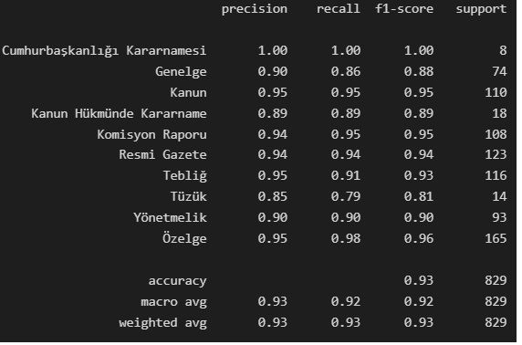

# Kamuda Mevzuat Arama Motoru Geliştirme

Belirlenen bu görevde; sınıflandırma, künye çıkarımı ve metin/bölüm analizi ile metni verilen bir içeriğin kategorisinin, buna bağlı aşağıda detayları verilmiş üst verileri ve ilgili kategoriler için "madde sayısı"nın tespiti hedeflenmektedir.

Kategori sınıflandırma problemi için ilk adım olarak preprocessing işlemlerine başladık ve gerekli regex işlemleri uygulayarak metinlerden şu ifadeleri kaldırdık:
- sayıları,
- tarihleri, 
- noktalama işaretlerini, 
- Türkçe stopwordsleri, 
- URL'leri,
- sayıları kaldırdıktan sonra oluşan artık "ıncı, inci, uncu, üncü" gibi ifadeleri,
- a, e, k gibi tek harfli ifadeleri,
- metinlerde geçen geçersiz ve artık ifadeleri (”, “ gibi)
- bu işlemlerden sonra oluşan çoklu-boşukları (multi-spaces)

Daha sonra fikir vermesi açısından base-modeller oluşturarak ilk sonuçlara baktık. 

modelling.py içindeki işlemler uygulandıktan sonra şu sonuçları alıyoruz:

### <b>1. Basit LinearSVC modeli:</b>

### <b>2. FastText:</b>

- train accuracy : 0.9459704195593118,
- validation accuracy : 0.9348612786489746

